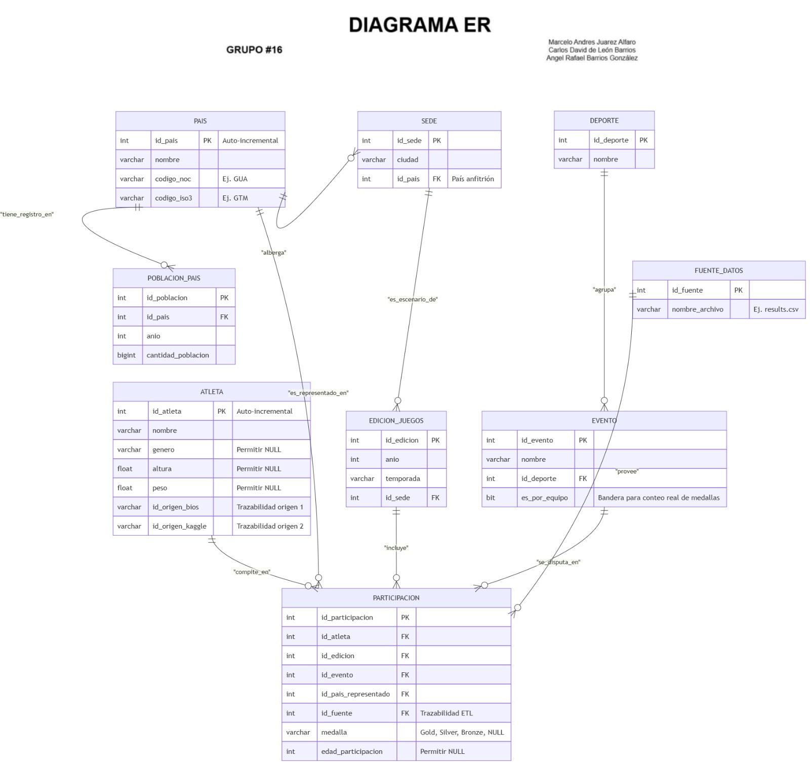
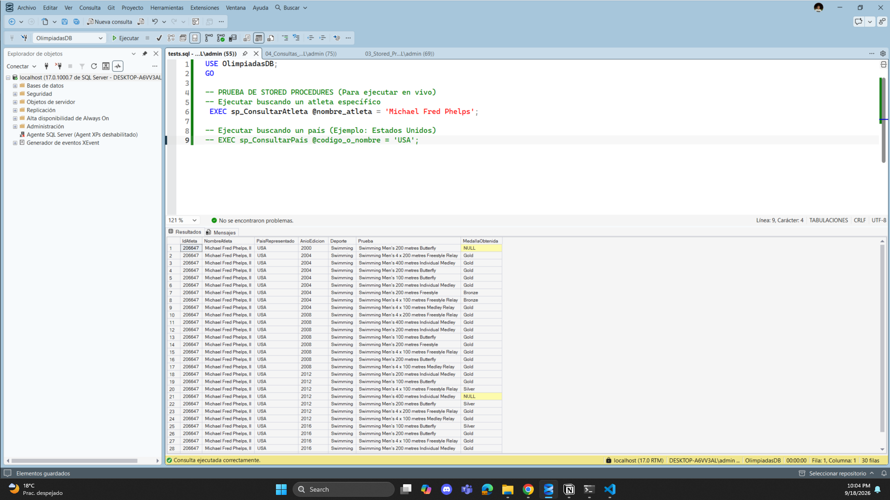

# Documentación del Proyecto Fase 1: Base de Datos Olimpiadas (1896 - 2024)

**Universidad de San Carlos de Guatemala**

**Facultad de Ingeniería - Escuela de Ciencias y Sistemas**

**Sistemas de Bases de Datos 2 - 2do. Semestre 2026**

**Grupo:** #16 

**Integrantes:**

- Marcelo André Juárez Alfaro - 202010367
- Carlos David de León Barrios - 202112109
- Angel Rafael Barrios González - 202300733

## 1. Introducción y Alcance

El presente proyecto tiene como objetivo la integración, limpieza y consolidación de la información histórica de los Juegos Olímpicos desde Atenas 1896 hasta París 2024. Los datos provienen de cuatro fuentes heterogéneas principales: repositorios de Kaggle, datasets de Keith Galli y DataCamp, tomando como validación de calidad el sitio oficial olympics.com. La arquitectura de solución emplea Python (mediante Jupyter Notebooks) para los procesos de Extracción, Transformación y Carga (ETL) desde los archivos crudos, y Microsoft SQL Server para el alojamiento, persistencia y consulta analítica de la base de datos relacional resultante.

## 2. Modelo Entidad-Relación (ER)

El modelado de datos se diseñó bajo un enfoque relacional pragmático orientado a esquema de estrella/copo de nieve, minimizando la hiper-normalización para evitar uniones (`JOIN`) excesivas y garantizando la integridad referencial.

El núcleo del modelo es la tabla central de hechos `PARTICIPACION`, la cual se encuentra rodeada por entidades dimensionales maestras: `ATLETA`, `PAIS`, `SEDE`, `EDICION_JUEGOS`, `EVENTO`, `DEPORTE`, `POBLACION_PAIS` y `FUENTE_DATOS`.

## 3. Proceso ETL y Limpieza de Datos

La limpieza de la información cruda se gestionó mediante los archivos `etl_carga.ipynb` y `auditoria.ipynb`, resolviendo los siguientes desafíos críticos de los datos origen:

- **Resolución de Colisiones de Identificadores:** Debido a que distintas fuentes (ej. Kaggle vs. Keith Galli) poseían diferentes atletas con el mismo `ID` original, se implementó un campo de llave primaria autoincremental (`id_atleta INT IDENTITY(1,1)`) en la tabla final, resguardando los códigos originales en columnas de trazabilidad (`id_origen_bios`, `id_origen_kaggle`).
- **Homologación de Códigos Geográficos:** Se integraron tanto los códigos internacionales de tres letras del Banco Mundial (`codigo_iso3`) como los del Comité Olímpico (`codigo_noc`) en la entidad `PAIS` para mantener la integridad relacional con las estadísticas de población y sedes.
- **Manejo de Valores Nulos:** Los datos faltantes de origen (estatura, peso, edad o género) se conservaron e ingresaron en la base de datos como valores `NULL` estrictos en lugar de cadenas vacías o ceros.

## 4. Implementación de Procedimientos Almacenados (Stored Procedures)

Se implementaron y compilaron en SQL Server los requerimientos analíticos solicitados en el enunciado:

### 4.1. Procedimiento: `sp_ConsultarAtleta`

Permite buscar un atleta por su nombre y muestra de manera unificada el país que representó, el año de edición, el deporte, la prueba específica y la medalla obtenida. Se incluyen parámetros opcionales para filtrar resultados por deporte, país o año.

### 4.2. Procedimiento: `sp_ConsultarPais`

Recibe como parámetro de entrada el nombre o código del país y ejecuta múltiples consultas de validación.

- **Medallero Deduplicado:** Aplica lógica condicional para contar de manera individual las medallas de disciplinas convencionales (`es_por_equipo = 0`), y utiliza cláusulas `DISTINCT` sobre eventos de equipo (`es_por_equipo = 1`) para evitar la sobrestimación de preseas en el medallero total.
- **Historial de Sedes:** Cruza la información del país con las entidades `SEDE` y `EDICION_JUEGOS` para desplegar la ciudad y el año en que ha sido anfitrión, indicando mediante un bloque `IF NOT EXISTS` si la nación nunca ha sido sede.

## 5. Consultas de Validación y Evidencias

Durante las pruebas de control de calidad sobre la base de datos restaurada (`OlimpiadasDB.bak`), se ejecutaron las siguientes consultas analíticas demostrando la coherencia del modelo:

### A. Medallistas por País Específico (Ej. Guatemala)

Demostración del uso de llaves foráneas (`INNER JOIN`) filtrando por código NOC y descartando participaciones sin medalla.

### B. El Medallero Real e Histórico

Validación estricta de países con mayor cantidad de oros oficiales en la historia, agrupando por edición y evento para confirmar que los deportes colectivos suman una sola medalla por país.

### C. Ausencia de Datos (Uso de NULL)

Comprobación de registro de atletas que compitieron pero no obtuvieron medalla, evidenciando que el motor procesa el estado de ausencia correctamente con cláusulas `IS NULL`.

