# Documentación Técnica — Proyecto Fase 2: Respaldo y Restauración de Bases de Datos

## **1. Descripción de la Metodología**

El proyecto implementa un ciclo integral de **respaldo físico y recuperación ante desastres (Disaster Recovery)** sobre la base de datos relacional normalizada de los Juegos Olímpicos (OlimpiadasDB). Para evaluar el comportamiento del motor bajo distintas cargas operativas, la metodología se divide en cuatro fases estructuradas:

1. **Fase 1 — Preparación y Diseño del Entorno:** Configuración del modelo de recuperación en modo FULL (ALTER DATABASE ... SET RECOVERY FULL), creación de directorios dedicados en almacenamiento local (C:\Backups_Fase2\) y definición de la estrategia de respaldo combinando **Respaldo Completo (Full Backup)** y **Respaldos Diferenciales (Differential Backups)**.
2. **Fase 2 — Ejecución de Cargas Masivas y Respaldos en Consola:** A partir de la base de datos depurada de la Fase 1 (OlimpiadasDB, con registros de 1896 a 2024), se realizan tres escenarios independientes de carga (por Año, por Deporte/Evento y por Deportista). En cada escenario se ejecuta una carga base seguida de un **Full Backup**, y posteriormente 3 cargas incrementales de datos seguidas cada una de un **Backup Diferencial** mediante la utilidad de línea de comandos sqlcmd. Tras cada inserción se audita la cardinalidad (SELECT COUNT(_)), una muestra de registros (SELECT _) y el porcentaje de fragmentación física de los índices (sys.dm_db_index_physical_stats).
3. **Fase 3 — Simulación de Desastre y Restauración:** Se elimina por completo la base de datos (DROP DATABASE) y se restaura secuencialmente el estado inicial (solo Full Backup) y cada uno de los tres puntos en el tiempo (Full Backup WITH NORECOVERY + Differential Backup WITH RECOVERY), registrando las páginas procesadas, velocidades de transferencia (MB/s) y tiempos de restauración en segundos.
4. **Fase 4 — Validación Post-Restauración y Análisis Comparativo:** Verificación de integridad referencial y conteos tras cada restauración, contrastando el rendimiento y el impacto de la fragmentación de páginas (_page splits_) en el tamaño y velocidad de los respaldos.

## **2. Especificaciones Técnicas del Servidor y Entorno**

| **Parámetro**                               | **Especificación Técnica**                                                                       |
| ------------------------------------------- | ------------------------------------------------------------------------------------------------ |
| **Nombre de la Instancia / Host**           | DESKTOP-A6VV3AL (localhost)                                                                      |
| **Sistema Gestor de Base de Datos (DBMS)**  | Microsoft SQL Server (Instancia MSSQL17.MSSQLSERVER)                                             |
| **Herramienta de Línea de Comandos (CLI)**  | sqlcmd con Microsoft ODBC Driver 18 for SQL Server (flag -C habilitado)                          |
| **Modelo de Recuperación (Recovery Model)** | FULL (Soporte completo para respaldos Full, Diferenciales y de Log)                              |
| **Tipo de Respaldo Ejecutado**              | Respaldos físicos nativos a nivel de páginas y extensiones (.bak), no volcados lógicos (_dumps_) |
| **Ruta Física de Almacenamiento**           | C:\Backups_Fase2\Carga_Anio\ y C:\Backups_Fase2\Scripts\                                         |

## **3. Modelo Entidad-Relación (E-R) Utilizado**

El esquema relacional consta de **9 tablas normalizadas** que garantizan la integridad referencial y evitan redundancia de datos:

- **PAIS (id_pais PK):** Catálogo de Comités Olímpicos Nacionales (codigo_noc, codigo_iso3, nombre) con 235 registros.
- **POBLACION_PAIS (id_poblacion PK, id_pais FK):** Histórico demográfico anual por país.
- **SEDE (id_sede PK, id_pais FK):** Ciudades anfitrionas de los Juegos Olímpicos (42 sedes registradas).
- **EDICION_JUEGOS (id_edicion PK, id_sede FK):** Ediciones olímpicas identificadas por anio y temporada (_Summer_ / _Winter_, 54 ediciones de 1896 a 2024).
- **DEPORTE (id_deporte PK):** Catálogo de las 147 disciplinas olímpicas.
- **EVENTO (id_evento PK, id_deporte FK):** Catálogo de las 2,280 pruebas específicas, incluyendo la bandera booleana es_por_equipo.
- **FUENTE_DATOS (id_fuente PK):** Trazabilidad de los archivos origen del proceso ETL.
- **ATLETA (id_atleta PK):** Registro único de 244,745 atletas con atributos físicos y llaves de trazabilidad (id_origen_bios, id_origen_kaggle).
- **PARTICIPACION (id_participacion PK):** Tabla central de hechos (386,195 registros totales hasta París 2024) que vincula id_atleta, id_edicion, id_evento, id_pais_representado, id_fuente, medalla y edad_participacion.

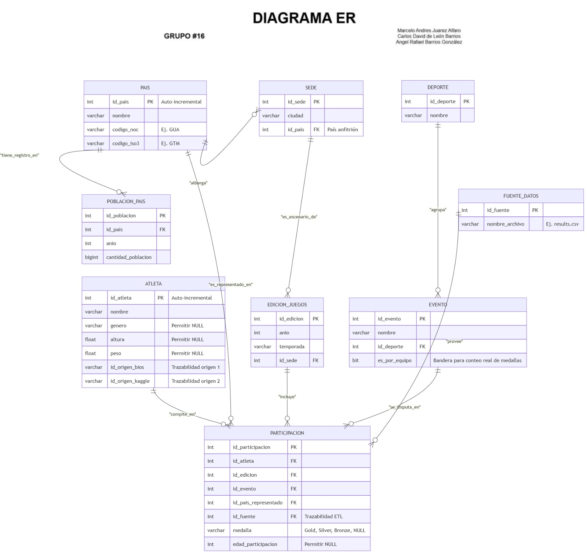

## **4. Plan de Respaldo y Recuperación**

En SQL Server, la estrategia combinada **Full + Diferencial** opera a nivel físico mediante mapas de bits internos llamados **DCM (_Differential Changed Map_)**:

1. **Respaldo Completo (Full Backup):** Copia la totalidad de las páginas de datos ocupadas (extents de 8 páginas de 8 KB c/u) y limpia el mapa DCM, estableciendo la **línea base (Baseline)**.
2. **Respaldos Diferenciales (WITH DIFFERENTIAL):** Registran únicamente las extensiones que han sufrido modificaciones (INSERT, UPDATE, DELETE o divisiones de página por _page splits_) desde el último Full Backup.
   - **Ventaja crítica en restauración:** A diferencia de los respaldos incrementales por cadena que obligan a aplicar cada archivo intermedio (Full + Inc1 + Inc2 + Inc3), los respaldos diferenciales son **acumulativos respecto a la base**. Para restaurar el sistema al punto $N$, únicamente se requiere restaurar **2 archivos**: Full.bak (WITH NORECOVERY) + Diff_N.bak (WITH RECOVERY).

## **5. Ejecución y Evidencias — Escenario 1: Carga por Año**

Para este escenario se creó la instancia limpia OlimpiadasDB_Anio, ejecutando la siguiente secuencia cronológica:

- **Carga Inicial:** Histórico 1896–2014 (338,207 participaciones) $\rightarrow$ **Full Backup**.
- **Sub-carga 1:** Edición **Río 2016** (+17,977 participaciones) $\rightarrow$ **Backup Diferencial 1**.
- **Sub-carga 2:** Edición **Tokio 2020** (+15,120 participaciones) $\rightarrow$ **Backup Diferencial 2**.
- **Sub-carga 3:** Edición **París 2024** (+14,891 participaciones) $\rightarrow$ **Backup Diferencial 3**.

### **5.1 Carga Inicial (1896–2014) y Full Backup**

- **Comando ejecutado:** sqlcmd -S localhost -E -C -i "C:\Backups_Fase2\Scripts\01_Carga_Inicial_Anio.sql"
- **Resultado:** 338,207 filas en PARTICIPACION, 9,900 en POBLACION_PAIS y 51 en EDICION_JUEGOS. Fragmentación inicial de PARTICIPACION: **0.06%** (1,604 páginas).

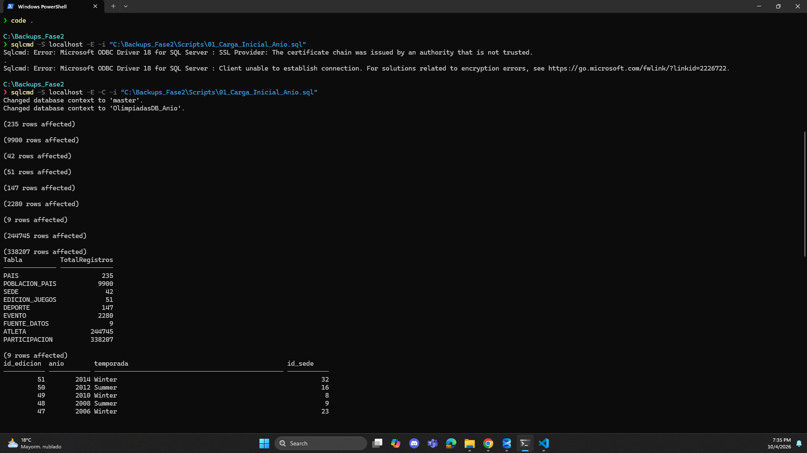

- **Comando Full Backup:** sqlcmd -S localhost -E -C -Q "BACKUP DATABASE OlimpiadasDB_Anio TO DISK = 'C:\Backups_Fase2\Carga_Anio\OlimpiadasDB_Anio_Full.bak' WITH FORMAT, INIT, NAME = 'Full Backup Carga Inicial Anio', STATS = 10;"
- **Métricas del respaldo:** 4,258 páginas procesadas en **0.049 segundos** (678.810 MB/sec).

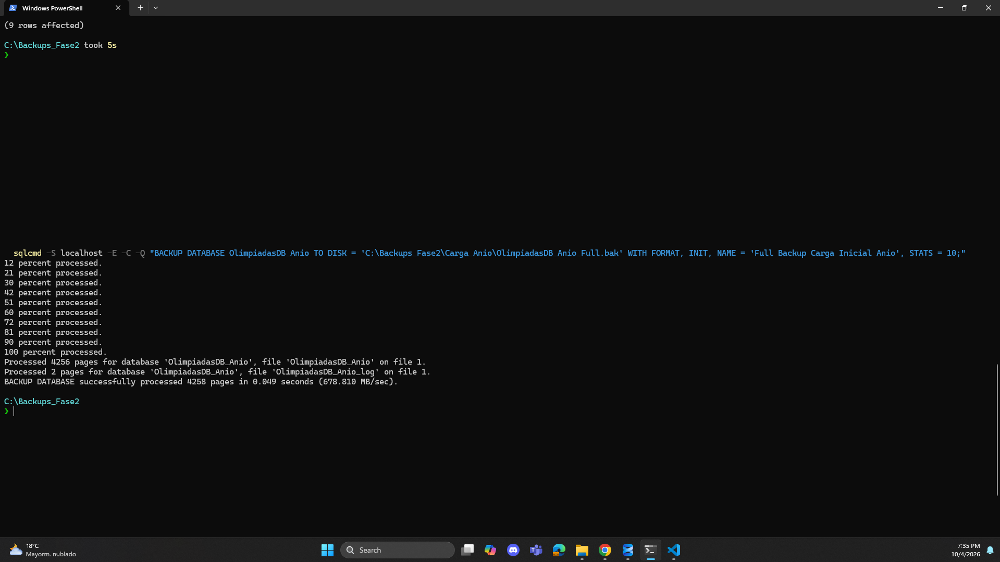

### **5.2 Sub-carga 1: Río 2016 y Backup Diferencial 1**

- **Comando ejecutado:** sqlcmd -S localhost -E -C -i "C:\Backups_Fase2\Scripts\02_Carga_Anio_2016.sql"
- **Resultado:** PARTICIPACION sube a **356,184** registros (+17,977), POBLACION_PAIS a 10,260 y EDICION_JUEGOS a 52. La fragmentación del índice primario de PARTICIPACION se eleva a **91.94%** (3,003 páginas) debido a la inserción de llaves primarias no secuenciales que provocan _page splits_.

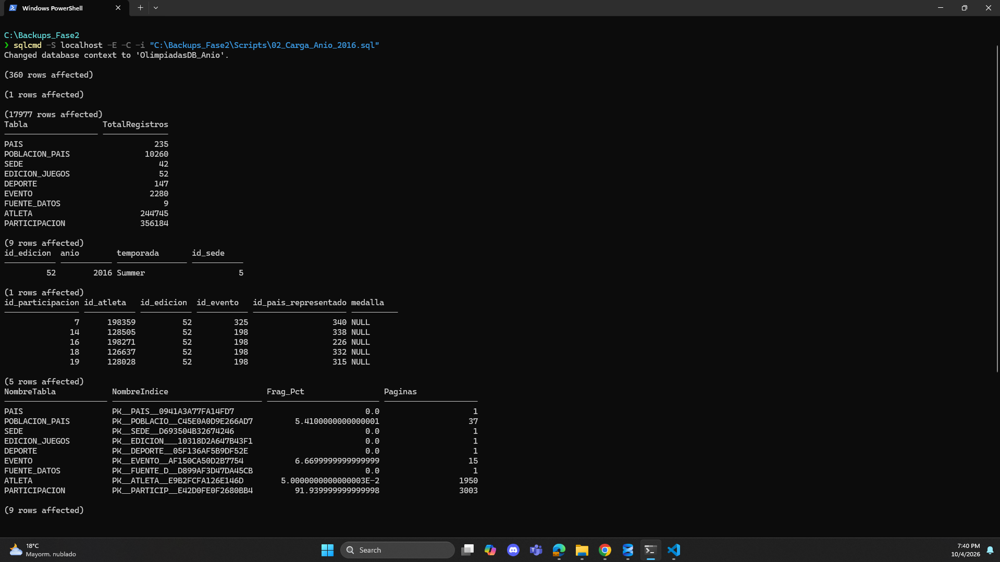

- **Comando Backup Diferencial 1:** sqlcmd -S localhost -E -C -Q "BACKUP DATABASE OlimpiadasDB_Anio TO DISK = 'C:\Backups_Fase2\Carga_Anio\OlimpiadasDB_Anio_Diff_1_2016.bak' WITH DIFFERENTIAL, FORMAT, INIT, NAME = 'Diff Backup 1 - Rio 2016', STATS = 10;"
- **Métricas del respaldo:** 3,162 páginas procesadas en **0.037 segundos** (667.546 MB/sec).

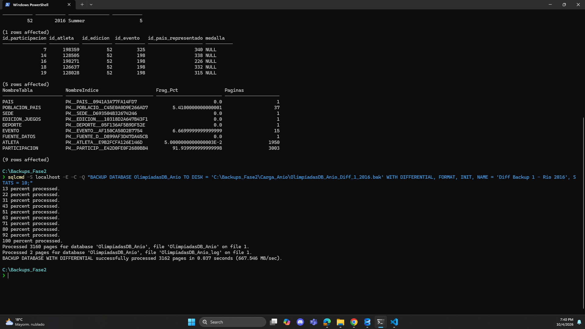

### **5.3 Sub-carga 2: Tokio 2020 y Backup Diferencial 2**

- **Comando ejecutado:** sqlcmd -S localhost -E -C -i "C:\Backups_Fase2\Scripts\03_Carga_Anio_2020.sql"
- **Resultado:** PARTICIPACION sube a **371,304** registros (+15,120), POBLACION_PAIS a 10,980 y EDICION_JUEGOS a 53. Fragmentación de PARTICIPACION: **89.86%** (3,077 páginas).

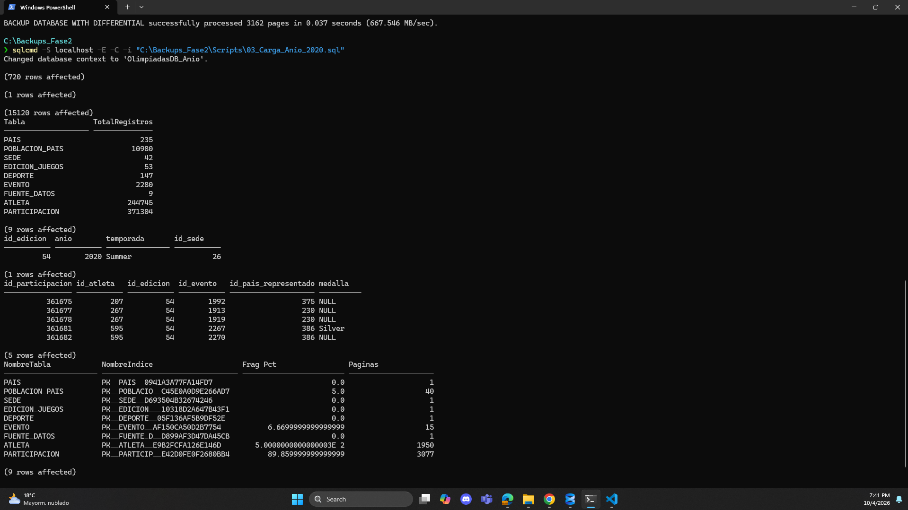

- **Comando Backup Diferencial 2:** sqlcmd -S localhost -E -C -Q "BACKUP DATABASE OlimpiadasDB_Anio TO DISK = 'C:\Backups_Fase2\Carga_Anio\OlimpiadasDB_Anio_Diff_2_2020.bak' WITH DIFFERENTIAL, FORMAT, INIT, NAME = 'Diff Backup 2 - Tokio 2020', STATS = 10;"
- **Métricas del respaldo:** 3,234 páginas procesadas en **0.030 segundos** (842.057 MB/sec).

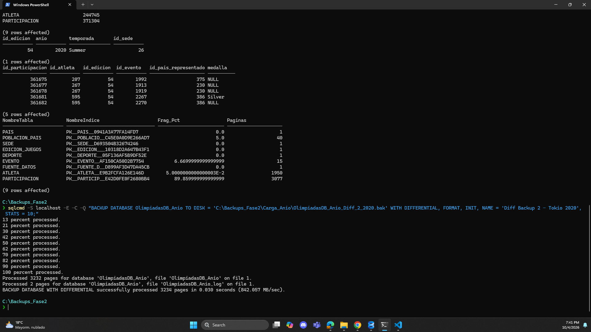

### **5.4 Sub-carga 3: París 2024 y Backup Diferencial 3**

- **Comando ejecutado:** sqlcmd -S localhost -E -C -i "C:\Backups_Fase2\Scripts\04_Carga_Anio_2024.sql"
- **Resultado:** PARTICIPACION alcanza el total histórico de **386,195** registros (+14,891), POBLACION_PAIS llega a 11,520 y EDICION_JUEGOS a 54. Fragmentación de PARTICIPACION: **92.16%** (3,213 páginas).

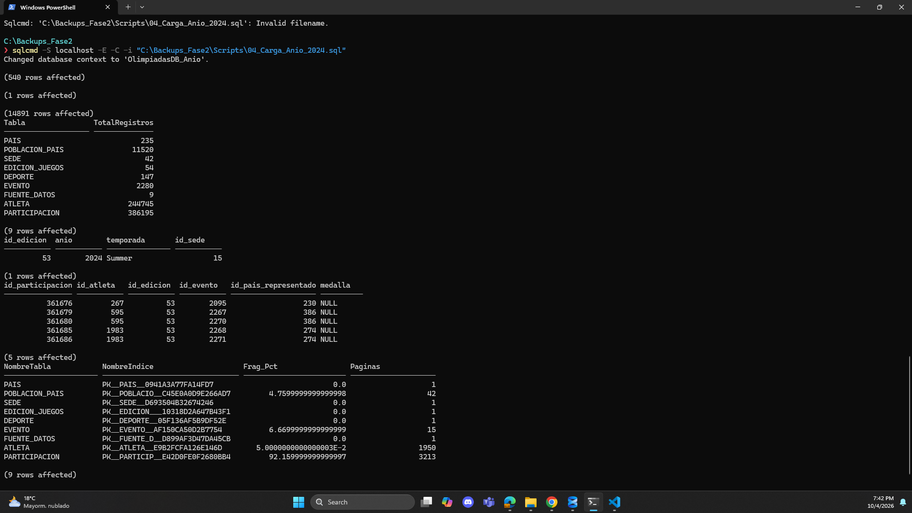

- **Comando Backup Diferencial 3:** sqlcmd -S localhost -E -C -Q "BACKUP DATABASE OlimpiadasDB_Anio TO DISK = 'C:\Backups_Fase2\Carga_Anio\OlimpiadasDB_Anio_Diff_3_2024.bak' WITH DIFFERENTIAL, FORMAT, INIT, NAME = 'Diff Backup 3 - Paris 2024', STATS = 10;"
- **Métricas del respaldo:** 3,378 páginas procesadas en **0.032 segundos** (824.584 MB/sec).

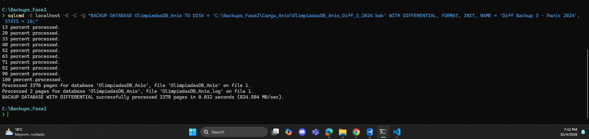

## **6. Eliminación de la Base de Datos, Restauración y Validación Post-Restauración**

Para cada prueba de recuperación se ejecutó DROP DATABASE OlimpiadasDB_Anio seguido de la restauración por consola y el script de auditoría 05_Validar_Restauracion_Anio.sql:

### **6.1 Restauración 1: Solo Full Backup (Estado Inicial 1896–2014)**

- **Tiempo de Restauración:** 4,258 páginas restauradas en **0.069 segundos** (482.053 MB/sec).
- **Validación de Integridad:** PARTICIPACION = 338,207, EDICION_JUEGOS = 51 (última edición: 2014 Winter).

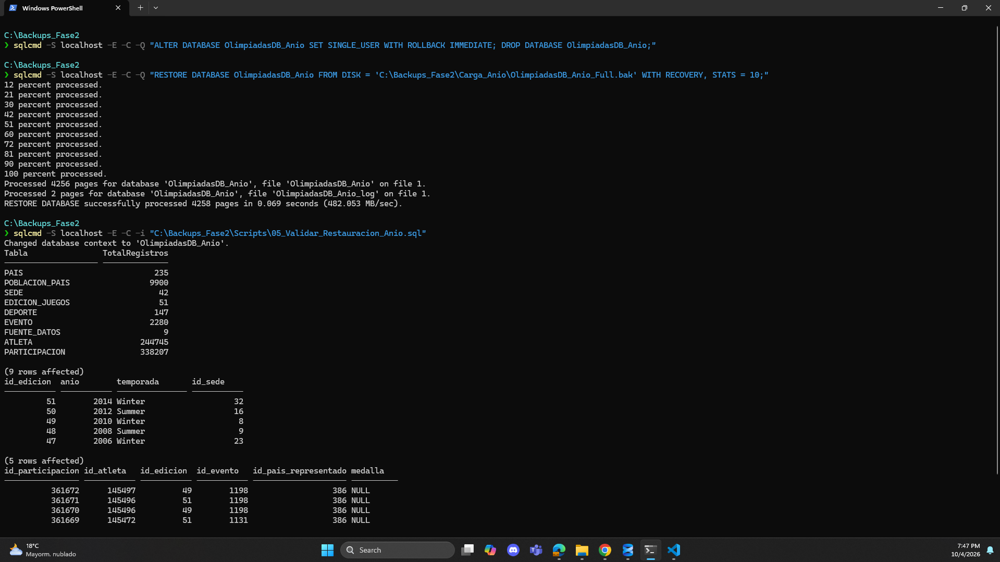

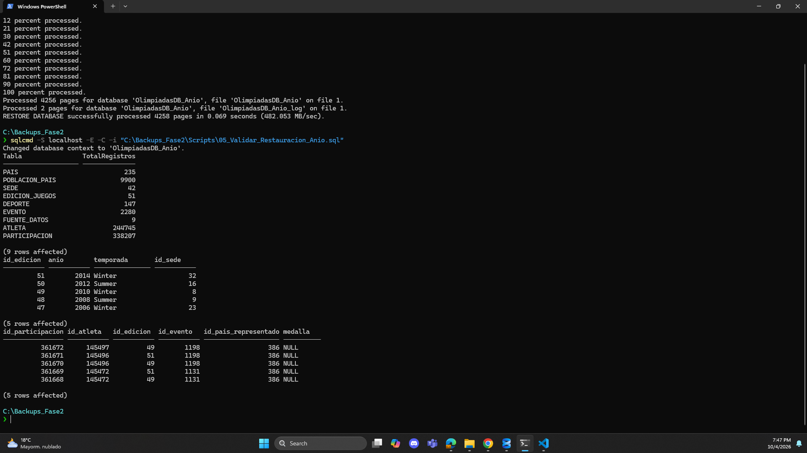

### **6.2 Restauración 2: Full Backup (NORECOVERY) + Diferencial 1 (Río 2016)**

- **Tiempo de Restauración:** Base Full (0.064 s) + Diferencial 1 (3,162 páginas en **0.055 segundos**, 449.076 MB/sec) = **0.119 segundos totales**.
- **Validación de Integridad:** PARTICIPACION = 356,184, EDICION_JUEGOS = 52 (aparece 2016 Summer).

### **6.3 Restauración 3: Full Backup (NORECOVERY) + Diferencial 2 (Tokio 2020)**

- **Tiempo de Restauración:** Base Full (0.069 s) + Diferencial 2 (3,234 páginas en **0.055 segundos**, 459.303 MB/sec) = **0.124 segundos totales**.
- **Validación de Integridad:** PARTICIPACION = 371,304, EDICION_JUEGOS = 53 (aparece 2020 Summer).

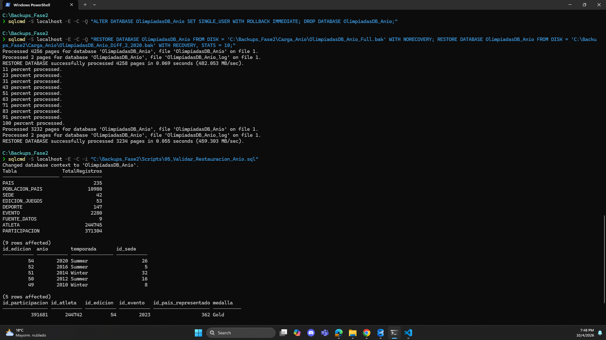

### **6.4 Restauración 4: Full Backup (NORECOVERY) + Diferencial 3 (París 2024 Completo)**

- **Tiempo de Restauración:** Base Full (0.067 s) + Diferencial 3 (3,378 páginas en **0.055 segundos**, 479.758 MB/sec) = **0.122 segundos totales**.
- **Validación de Integridad:** PARTICIPACION = 386,195, EDICION_JUEGOS = 54 (aparece 2024 Summer y el 100% de la información íntegra).

## **7. Tabla Comparativa de Resultados (Escenario 1: Carga por Año)**

| **Operación / Punto de Recuperación** | **Filas en PARTICIPACION** | **Páginas Respaldadas** | **Frag. Índice PARTICIPACION** | **Tiempo de Backup (s)** | **Velocidad Backup (MB/s)** | **Tiempo Restore Individual (s)** | **Tiempo Restore Acumulado (s)** |
| ------------------------------------- | -------------------------- | ----------------------- | ------------------------------ | ------------------------ | --------------------------- | --------------------------------- | -------------------------------- |
| **Carga Inicial + Full Backup**       | 338,207                    | 4,258                   | 0.06 %                         | 0.049 s                  | 678.81                      | 0.069 s                           | **0.069 s**                      |
| **Sub-carga 1 (2016) + Diff 1**       | 356,184                    | 3,162                   | 91.94 %                        | 0.037 s                  | 667.55                      | 0.055 s                           | **0.119 s** _(0.064 + 0.055)_    |
| **Sub-carga 2 (2020) + Diff 2**       | 371,304                    | 3,234                   | 89.86 %                        | 0.030 s                  | 842.06                      | 0.055 s                           | **0.124 s** _(0.069 + 0.055)_    |
| **Sub-carga 3 (2024) + Diff 3**       | 386,195                    | 3,378                   | 92.16 %                        | 0.032 s                  | 824.58                      | 0.055 s                           | **0.122 s** _(0.067 + 0.055)_    |

#
